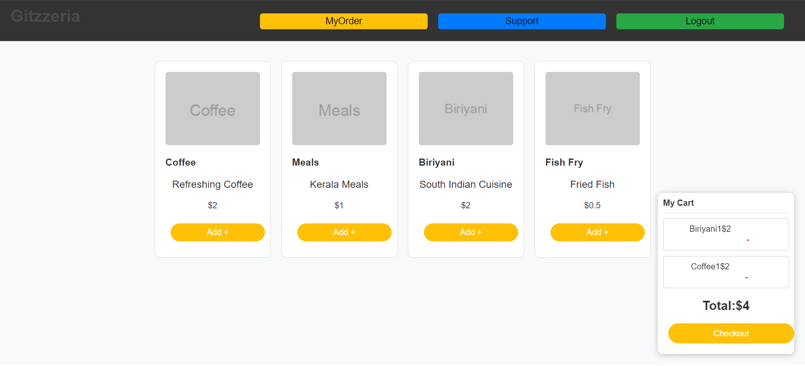
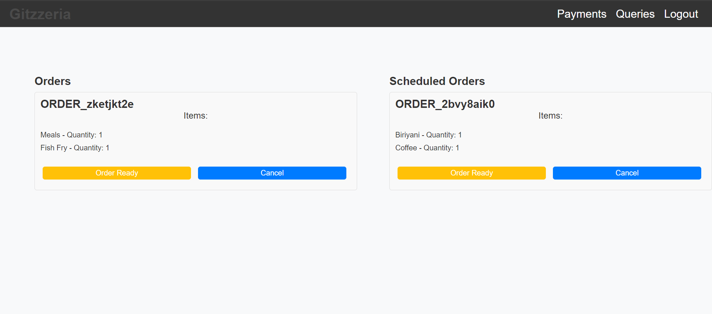
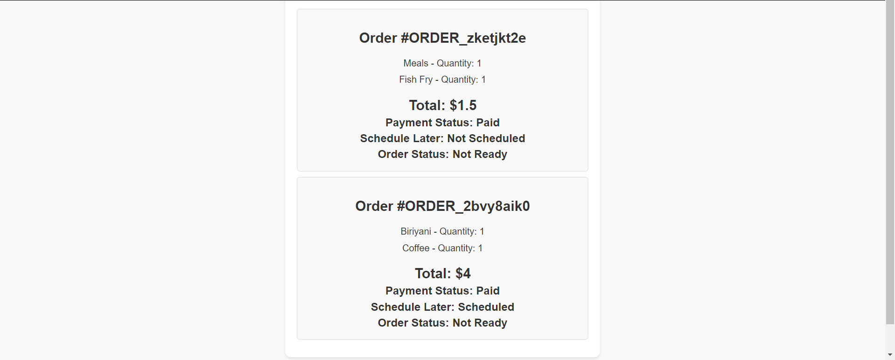
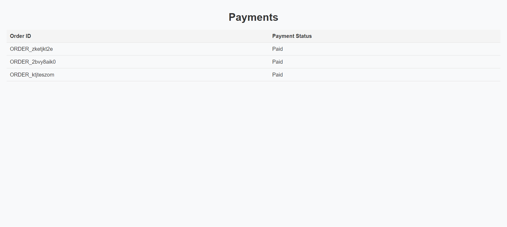
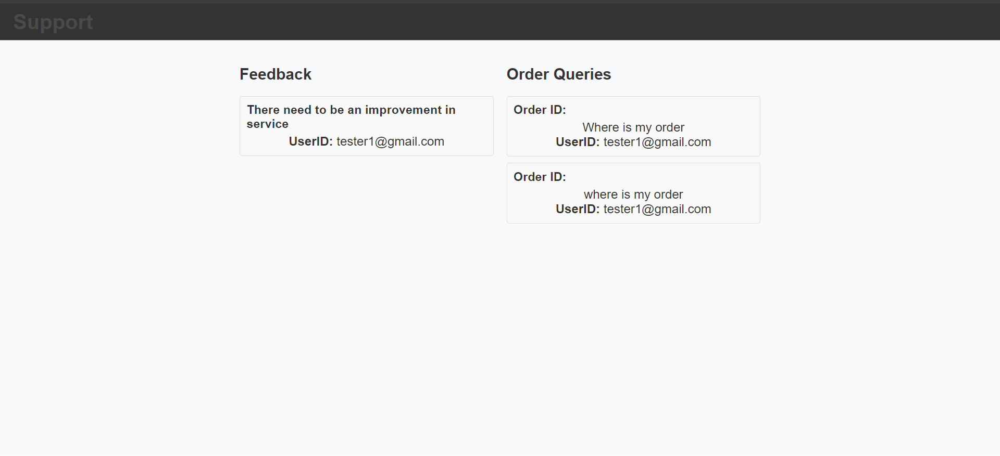
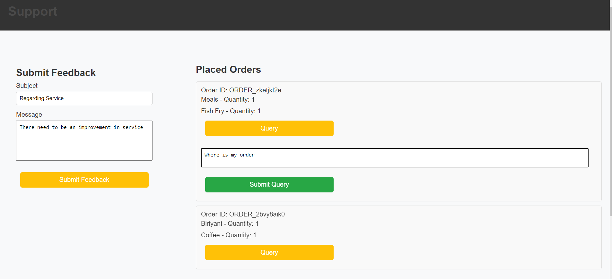

# 🍕 GITZZERIA - Revolutionizing the Campus Canteen Experience

**Gitzzeria** is an innovative, full-featured cashless canteen platform built to modernize and streamline the dining experience within college campuses. With a focus on **speed, convenience, and transparency**, Gitzzeria empowers students, faculty, and staff to skip the queues, place digital orders, and enjoy real-time updates—all through an elegant, user-first interface.

Whether you're grabbing a quick bite between classes or managing the backend operations of a bustling campus cafeteria, Gitzzeria provides the tools you need for a seamless experience from menu to meal.

---

## 📚 Table of Contents

- [✨ Features](#-features)
- [🧰 Tech Stack](#-tech-stack)
- [🚀 Getting Started](#-getting-started)
- [📸 Screenshots](#-screenshots)
- [🛠 Future Enhancements](#-future-enhancements)
- [🤝 Contributing](#-contributing)
- [🪪 License](#-license)

---

## ✨ Features

- 📱 **Modern, Responsive UI**  
  Sleek, mobile-first design built with TailwindCSS for seamless navigation across devices.

- 🛒 **Interactive Digital Menu**  
  Easily browse and customize your favorite items from the canteen's live menu.

- ⏱ **Order Scheduling & Virtual Queue**  
  Skip the line! Schedule meals ahead and track queue position in real-time.

- 💳 **Secure Cashless Payments**  
  Powered by Razorpay for fast and secure transactions with UPI, cards, and wallets.

- 📬 **Real-Time Notifications**  
  Get instant updates on order confirmation, status, and pickup availability.

- 📊 **Comprehensive Admin Dashboard**  
  Manage menus, monitor orders, view analytics, and respond to feedback—all in one place.

- 💬 **Built-in Feedback System**  
  Let users submit reviews or issues to improve the dining experience continuously.

- 🔐 **Firebase Authentication**  
  Secure login and role-based access powered by Firebase Auth.

---

## 🧰 Tech Stack

**Frontend**  
- React (Vite)  
- TailwindCSS  
- HTML5, CSS3, JavaScript

**Backend & Database**  
- Firebase  
  - Firestore (Database)  

**Payments**  
- Razorpay API

**Dev Tools**  
- Node.js & npm  
- Git & GitHub  
- Visual Studio Code

---

## 🚀 Getting Started

To run this project locally:

```bash
# 1. Clone the repository
git clone https://github.com/Noel9812/Gitzzeriaa.git

# 2. Navigate to the project directory
cd Project

# 3. Install dependencies
npm install

# 4. Start the development server
npm run dev
```

---

## 📸 Screenshots

> _A picture speaks a thousand lines of code!_  
Here are some visuals from **Gitzzeria**:

###  Landing Page


###  Menu Page


###  Admin Panel


###  Placed Order


###  Payment Status


###  Queries Page


###  Support Page



---

## 🛠 Future Enhancements

- 📦 **Meal Plan Subscriptions**  
  Allow students to subscribe to weekly/monthly meal plans for added convenience and budgeting ease.

- 📈 **Analytics Dashboard**  
  Generate insightful reports on order volume, peak hours, user preferences, and revenue trends to help staff make data-driven decisions.

- 🌍 **Multilingual Support**  
  Expand accessibility with support for multiple languages catering to a diverse student population.

- 🧾 **Inventory Management**  
  Add a backend module to track ingredients, monitor stock levels, and receive restocking alerts.

- 📲 **Progressive Web App (PWA)**  
  Enable users to install Gitzzeria as a native-like app on their phones and access it offline.

---

## 🤝 Contributing

We love contributions! 💛  
If you have an idea or improvement, we’d love to see it:

1. **Fork** the repository  
2. **Create a new branch** (git checkout -b feature/my-feature)
3. **Make your changes**
4. Commit and push (git commit -m "Add feature" → git push origin feature/my-feature)
5. Open a pull request with a meaningful description
